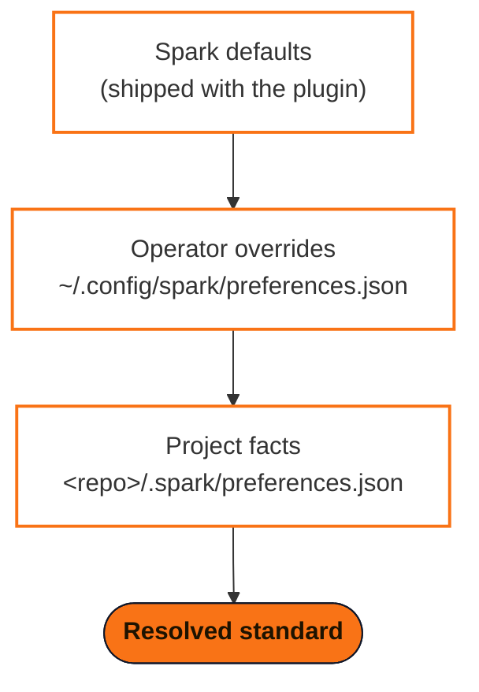

<div align="center">

<picture>
  <source media="(prefers-color-scheme: dark)" srcset="assets/logo/spark-lockup-dark.svg">
  
</picture>

**Turn your Claude and GitHub subscriptions into a software delivery system.**

[](https://github.com/jwogrady/spark/releases)
[](https://github.com/jwogrady/spark/actions/workflows/validate.yml)
[](https://docs.anthropic.com/en/docs/claude-code)
[](LICENSE)

[Quick start](#start-shipping) ·
[The lifecycle](#one-lifecycle-carried-everywhere) ·
[Your standards](#your-standards-loaded-once) ·
[Guardrails](#guardrails-that-actually-run) ·
[The plugins](#the-plugin-family) ·
[Docs](#documentation)

</div>

---

You are one developer with a Claude subscription, a GitHub subscription, and
more ideas than hours. Claude can write and review code. GitHub can organize,
preserve, and ship it. But neither gives you a way to turn an idea into a
maintainable release. **Spark does.**

Spark is the project-engineering system built specifically for Claude Code and
GitHub. It loads your engineering standards, version-control conventions, and
workflow preferences into every project; lets you override them when a
repository needs different rules; and guides work through one traceable
lifecycle from intent to pull request. Decisions become documentation. Plans
become GitHub issues. Issues become branches and pull requests. Reviews become
gates instead of suggestions. Session state survives. The result is not AI
activity — it is more finished software, shipped with the consistency, memory,
and discipline of an engineering organization, using the subscriptions and
tools already on the desk.

## The force multiplier

Claude is capable. GitHub is durable. Spark makes them operate as one system.

| Without Spark | With Spark |
| --- | --- |
| Re-explain your preferences in every project | Load your standards automatically |
| Start each Claude session by reconstructing context | Begin with a project brief and resumable state |
| Let implementation choices disappear into chat history | Record decisions as durable project artifacts |
| Ask for a plan and receive a document-shaped wish list | Produce GitHub issues with scope and acceptance criteria |
| Trust conventions to memory | Enforce branch, commit, and push rules with hooks |
| Accumulate large, ambiguous changes | Work one issue per focused branch and pull request |
| Treat review as an optional final prompt | Validate against criteria before shipping |
| Maintain release plumbing by hand | Scaffold CI, documentation, and Release Please |

Spark does not replace Claude Code or GitHub. It supplies the project
engineering that lets both deliver more value.

## One lifecycle, carried everywhere


| Stage | Skill | What Spark makes durable |
| --- | --- | --- |
| **Ideate** | `/spark:ideate` | A confirmed problem statement, grounded in prior art and actual need |
| **Plan** | `/spark:plan` | Architecture decisions, scoped features, GitHub issues, and acceptance criteria |
| **Codify** | `/spark:codify` | One issue implemented as focused commits on one feature branch |
| **Validate** | `/spark:validate` | Code review, security review, verification, and committed fixes tied to the issue |
| **Ship** | `/spark:ship` | The reviewed branch published as one focused GitHub pull request |

Use the whole lifecycle for a new product or enter at the stage that matches
the work already in front of you. The workflow stays recognizable across every
repository, so your attention goes to the product instead of reinventing the
process.

## Your standards, loaded once

Spark carries a machine-readable engineering standard into every project,
resolved through three explicit tiers — later tiers win, and the resolved
result always shows where each value came from, so customization stays
explainable instead of becoming configuration folklore.



```bash
spark preferences          # show the resolved standard and each value's source
spark preferences --apply  # carry it into the current repository
```

Application can create the standard documentation set, stack-aware GitHub
Actions validation, and Release Please configuration. It is create-only and
idempotent: existing files are treated as project decisions and are never
silently overwritten.

## GitHub becomes the project record

Spark is built around GitHub rather than bolted onto it:

- Problem statements and ADRs preserve why the project exists and how it is built.
- GitHub issues hold scoped work and verifiable acceptance criteria.
- Short-lived branches isolate implementation.
- Conventional commits explain each completed change.
- Pull requests create the reviewable unit of delivery.
- GitHub Actions provides the repeatable validation gate.
- Release Please turns merged work into versions, changelogs, tags, and releases.

The history is useful to you, useful to collaborators, and — critically —
useful to Claude when the next session begins.

## Claude stops waking up with amnesia

At session start, `spark brief --short` orients Claude by **deriving** the
current branch, working state, lifecycle position, and resolved preferences
from git and GitHub — never by trusting a recorded snapshot, which is how
orientation goes stale. The one thing a repository cannot answer — what you
meant to do next, and what was blocking — is recorded by each lifecycle
stage's close-out in `.spark/state.json` and presented with its date. When
you need the complete picture, `spark resume` prints the derived reality
first and the recorded intent second, and refuses to replay an intent whose
pull request has already merged.

That means less subscription time spent rediscovering the project and more
time advancing it.

## Guardrails that actually run

Spark's standards are more than prose — the same rules are enforced on every
path that can reach the repository:

| Door | Fires when | Enforces |
| --- | --- | --- |
| `PreToolUse` guard | Claude runs a git command | Blocks force-pushes and pushes whose destination is trunk — through leading git options, full refspecs, and compound commands |
| Git hooks | You (or anyone) commits directly | Rejects commits on trunk, invalid conventional commits, and AI attribution |
| GitHub ruleset | Anything reaches the remote — API calls, other clones, hookless clients | The same trunk policy server-side: PRs required, merges gated on the repo's required CI checks, force-push and deletion blocked. Spark ships the policy and reports drift (`spark doctor --requirements`); applying it stays a human act |
| `spark doctor` | Locally and in CI | Plugin structure, scripts, documentation links, manifests, enforcement lockstep |
| Behavioral tests | Every pull request **to this repository** | Spark's own CI exercises the CLI flows and the local enforcement doors against throwaway repos — this is how Spark tests itself, not a suite added to your project (`preferences --apply` scaffolds *your* stack's validation instead) |

Claude can move quickly because Spark keeps the work inside boundaries you can
trust. The table above is a summary; the doctrine behind it — why three doors,
and why the remote one is never applied for you — lives in
[enforcement-model.md](plugins/spark/docs/explanation/enforcement-model.md).

## Start shipping

**Before you begin:** you need a Git repository, Claude Code, and an
authenticated GitHub CLI (`gh`) — `onboard` and the lifecycle create issues and
pull requests through it. Run `spark doctor --requirements` any time to check
your machine against the [supported-environment matrix](plugins/spark/docs/reference/compatibility.md),
which also lists what degrades gracefully when an optional tool is absent.

**1. Install Spark in Claude Code**

```text
/plugin marketplace add jwogrady/spark
/plugin install spark
```

**2. Carry Spark into a repository**

The guided first run is one command — it orients on the repo, helps you choose a
setup profile, seeds hooks + permissions + the standards docs, and ends with a
brief of what was created, kept, and still open:

```text
/spark:onboard
```

It stops at each human decision (an ambiguous repo, the profile choice, the
LICENSE) rather than guessing. Prefer the raw verbs? `/spark:onboard` just
sequences them, and each stands alone:

```bash
spark setup           # hooks + permissions + resolved standards, one command
spark doctor          # confirm the repo is armed
```

`spark setup` is idempotent. The granular commands remain available when you
want to apply or inspect each step separately.

**3. Run the lifecycle**

```text
/spark:ideate → /spark:plan → /spark:codify → /spark:validate → /spark:ship
```

The full environment contract — required versus optional tools, and what
degrades gracefully — is the
[supported-environment matrix](plugins/spark/docs/reference/compatibility.md),
and `spark doctor --requirements` is its executable form.

## The plugin family

One marketplace, four installable plugins. The core is the shipping loop;
install a companion only when you need its job.

| Plugin | Job | Entry point | Install |
| --- | --- | --- | --- |
| **spark** | The shipping loop: the five lifecycle skills plus `onboard`, `bootstrap`, `knowledge`, `agents-md`, the CLI, and the enforcement doors (both local ones, plus the trunk-ruleset policy for the third) | `/spark:<skill>` | `/plugin install spark` |
| **spark-audit** | Whole-project assessment and evidence-backed cleanup | `/spark-audit:audit` | `/plugin install spark-audit` |
| **spark-connect** | Service connectivity and secrets via 1Password, including plaintext shredding | `/spark-connect:connect` | `/plugin install spark-connect` |
| **spark-docs** | Public docs and positioning through author personas | `/spark-docs:docit` | `/plugin install spark-docs` |

Each plugin versions independently and ships its own documentation and
changelog. The core's nine skills in one line:

| Category | Skills | Purpose |
| --- | --- | --- |
| **Lifecycle** | `ideate`, `plan`, `codify`, `validate`, `ship` | Move work from intent to pull request |
| **Setup** | `onboard`, `bootstrap` | Guide a repo's first run start to finish; scaffold a new project's runtime and wire it into the lifecycle |
| **Supporting** | `knowledge`, `agents-md` | Preserve internal knowledge; maintain `CLAUDE.md` and `AGENTS.md` |

Spark reuses Claude Code's native capabilities — including code review,
security review, and verification — then adds sequencing, persistence, GitHub
structure, and enforcement. You keep Claude's expanding toolset without
rebuilding your workflow whenever a new tool arrives.

## Built for the solo developer

Spark deliberately avoids becoming another project-management SaaS product. It
lives where you already work: Claude Code, Git, and GitHub. There is no extra
dashboard to maintain, no additional seat to buy, and no parallel source of
truth.

Use Spark when you want repeatability across projects, durable context between
sessions, and GitHub-backed delivery discipline. Skip it when you want an
unstructured coding session or when every repository must follow a completely
unrelated process.

Spark is MIT licensed and designed for single-developer work.

> **Spark is in Alpha (v0.x).** The engineering pipeline is proven; the
> *product* is still being validated by real users, and **breaking changes are
> expected** while we learn what to keep, change, or remove. If you'd like to
> help shape it, see the [Alpha program](docs/alpha/alpha-program.md). What a
> stable `v1.0.0` will protect — and what it deliberately won't — is already
> written down in the [stability contract](plugins/spark/docs/reference/stability.md);
> the [changelog](CHANGELOG.md) records every change.

## Documentation

| Start here | Reference | Understand |
| --- | --- | --- |
| [Get started](plugins/spark/docs/how-to/get-started.md) | [Choose a Spark skill](plugins/spark/docs/reference/skills.md) | [What Spark is](plugins/spark/docs/explanation/identity.md) |
| [Build your first project](plugins/spark/docs/tutorials/build-your-first-project.md) | [CLI reference](plugins/spark/docs/reference/cli.md) | [Roadmap](ROADMAP.md) |
| | [Engineering preferences](plugins/spark/docs/reference/engineering-preferences.md) | [Changelog](CHANGELOG.md) |
| | [Supported environments](plugins/spark/docs/reference/compatibility.md) | |
| | [Stability contract](plugins/spark/docs/reference/stability.md) | |

---

<div align="center">

<picture>
  <source media="(prefers-color-scheme: dark)" srcset="assets/logo/spark-mark-dark.svg">
  
</picture>

[MIT](LICENSE) © 2026 `jwogrady`

</div>
