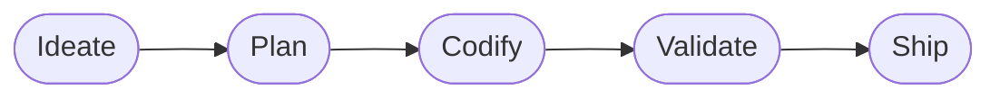

# Spark

> **Turn your Claude and GitHub subscriptions into a software delivery system.**


You are one developer with a Claude subscription, a GitHub subscription, and
more ideas than hours. Claude can write and review code. GitHub can organize,
preserve, and ship it. But neither gives you a way to
turn an idea into a maintainable release. **Spark does.** Spark is the
project-engineering system built specifically for Claude Code and GitHub. It
loads your engineering standards, version-control conventions, and workflow
preferences into every project; lets you override them when a repository needs
different rules; and guides work through one traceable lifecycle from intent to
pull request. Decisions become documentation. Plans become GitHub issues.
Issues become branches and pull requests. Reviews become gates instead
of suggestions. Session state survives. The result is not AI
activity—it is more finished software. Spark helps a solo developer work with
the consistency, memory, and shipping discipline of an engineering
organization, using the subscriptions and tools already on the desk.

- Get more usable output from your Claude subscription
- Make GitHub the durable memory for every project
- Apply the same engineering standards across repositories
- Customize global standards with explicit project overrides
- Turn ideas into scoped issues, focused branches, and reviewable pull requests
- Preserve decisions, progress, and context between Claude sessions
- Enforce version-control rules mechanically instead of hoping they are followed
- Ship deployable, documented, maintainable applications faster

## The force multiplier

Claude is capable. GitHub is durable. Spark makes them operate as one system.

| Without Spark | With Spark |
| --- | --- |
| Re-explain your preferences in every project | Load your standards automatically |
| Start each Claude session by reconstructing context | Begin with a project brief and resumable state |
| Let implementation choices disappear into chat history | Record decisions as durable project artifacts |
| Ask for a plan and receive a document-shaped wish list | Produce GitHub issues with scope and acceptance criteria |
| Trust conventions to memory | Enforce branch, commit, and push rules with hooks |
| Accumulate large, ambiguous changes | Work one issue per focused branch and pull request |
| Treat review as an optional final prompt | Validate against criteria before shipping |
| Maintain release plumbing by hand | Scaffold CI, documentation, and Release Please |

Spark does not replace Claude Code or GitHub. It supplies the project
engineering that lets both deliver more value.

## One lifecycle, carried everywhere



| Stage | What Spark makes durable |
| --- | --- |
| **Ideate** | A confirmed problem statement, grounded in prior art and actual need |
| **Plan** | Architecture decisions, scoped features, GitHub issues, and acceptance criteria |
| **Codify** | One issue implemented on one focused feature branch |
| **Validate** | Code review, security review, verification, and fixes tied to the issue |
| **Ship** | A conventional commit, pushed branch, and focused GitHub pull request |

Use the whole lifecycle for a new product or enter at the stage that matches the
work already in front of you. The workflow stays recognizable across every
repository, so your attention goes to the product instead of reinventing the
process.

## Your standards, loaded once

Spark carries a machine-readable engineering standard into every project. It
resolves preferences through three explicit tiers:

1. **Spark defaults** provide a disciplined baseline.
2. **Operator overrides** express how you prefer to work across all projects.
3. **Project overrides** capture the facts and exceptions of one repository.

Later tiers win. The resolved result always shows where each value came from,
so customization stays explainable instead of becoming configuration folklore.

```text
Spark defaults
    ↓ overridden by
~/.config/spark/preferences.json
    ↓ overridden by
<repo>/.spark/preferences.json
```

Apply the resolved standard to an existing repository:

```bash
spark preferences
spark preferences --apply
```

Spark can create the standard documentation set, stack-aware GitHub Actions
validation, and Release Please configuration. Application is create-only and
idempotent: existing files are treated as project decisions and are never
silently overwritten.

## GitHub becomes the project record

Spark is built around GitHub rather than bolted onto it:

- Problem statements and ADRs preserve why the project exists and how it is built.
- GitHub issues hold scoped work and verifiable acceptance criteria.
- Short-lived branches isolate implementation.
- Conventional commits explain each completed change.
- Pull requests create the reviewable unit of delivery.
- GitHub Actions provides the repeatable validation gate.
- Release Please turns merged work into versions, changelogs, tags, and releases.

The history is useful to you, useful to collaborators, and—critically—useful to
Claude when the next session begins.

## Claude stops waking up with amnesia

Spark records lifecycle progress in `.spark/state.json`. At session start,
`spark brief --short` orients Claude to the current branch, working state,
lifecycle position, and resolved preferences. When you need the complete
picture, `spark resume` cross-checks recorded state against the live repository
and flags drift instead of inventing certainty.

That means less subscription time spent rediscovering the project and more time
advancing it.

## Guardrails that actually run

Spark's standards are more than prose:

- A Claude Code `PreToolUse` guard blocks force-pushes and pushes to trunk before
  execution.
- Git hooks reject direct commits to trunk, invalid conventional commits, and AI
  attribution.
- `spark doctor` checks plugin structure, scripts, documentation links, hooks,
  manifests, and enforcement parity.
- GitHub Actions runs the same health gate used locally, preventing local and CI
  policy from drifting apart.

Claude can move quickly because Spark keeps the work inside boundaries you can
trust.

## Start shipping

### 1. Install Spark in Claude Code

```text
/plugin marketplace add jwogrady/spark
/plugin install spark
```

### 2. Carry Spark into a repository

```bash
spark setup           # hooks + permissions + resolved standards
spark doctor
```

`spark setup` is idempotent. The granular commands remain available when you
want to apply or inspect each step separately.

### 3. Run the lifecycle

```text
/spark:ideate
/spark:plan
/spark:codify
/spark:validate
/spark:ship
```

**Prerequisites:** a Git repository, Claude Code, and an authenticated GitHub
CLI (`gh`) for issue and pull-request creation.

## More than the happy path

Spark includes 12 focused skills:

| Category | Skills | Purpose |
| --- | --- | --- |
| **Lifecycle** | `ideate`, `plan`, `codify`, `validate`, `ship` | Move work from intent to pull request |
| **Setup** | `bootstrap`, `connect` | Scaffold runtimes and connect services safely |
| **Authorship** | `docit`, `knowledge` | Improve public documentation and preserve internal knowledge |
| **Supporting** | `agents-md`, `review`, `cleanup` | Maintain project instructions, audit projects, and remove proven cruft |

Spark reuses Claude Code's native capabilities—including code review, security
review, and verification—then adds sequencing, persistence, GitHub structure,
and enforcement. You keep Claude's expanding toolset without rebuilding your
workflow whenever a new tool arrives.

## Built for the solo developer

Spark deliberately avoids becoming another project-management SaaS product. It
lives where you already work: Claude Code, Git, and GitHub. There is no extra
dashboard to maintain, no additional seat to buy, and no parallel source of
truth.

Use Spark when you want repeatability across projects, durable context between
sessions, and GitHub-backed delivery discipline. Skip it when you want an
unstructured coding session or when every repository must follow a completely
unrelated process.

Spark is pre-1.0, MIT licensed, and designed for single-developer work. Treat
`v0.x` releases as potentially breaking while the project matures.

## Documentation

- [Build your first project](plugins/spark/docs/tutorials/build-your-first-project.md)
- [Choose a Spark skill](plugins/spark/docs/reference/skills.md)
- [Engineering preferences](plugins/spark/docs/reference/engineering-preferences.md)
- [CLI reference](plugins/spark/docs/reference/cli.md)
- [What Spark is](plugins/spark/docs/explanation/identity.md)
- [Roadmap](ROADMAP.md)
- [Changelog](CHANGELOG.md)

## License

[MIT](LICENSE) © 2026 `jwogrady`
