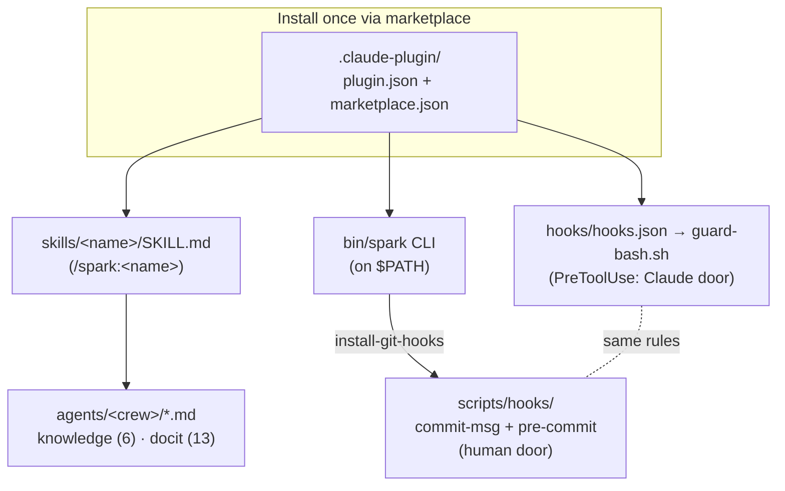

# Spark: architecture & internals

> Architecture map — how the layers fit together. The *why* lives in the linked
> ADRs and explanation docs; this doc ties the layers together and shows how they
> interact. For the reasoning behind individual decisions, follow the cross-links
> to [../explanation/](../../plugins/spark/docs/explanation/) and [../adr/](../adr/).

## Purpose

Spark is a portable project-inception and software-delivery system for
AI-assisted development: it turns raw project intent into durable repo artifacts,
branches, reviews, commits, and PRs (scoped GitHub issue generation is a v0.4
goal). The methodology is portable; the current implementation ships as a
**Claude Code plugin** (manifest version 0.3.1, author `jwogrady`, MIT) you install
once and carry into every project.

Who it is for: the operator running many projects under one disciplined Claude
Code workflow — `jwogrady` / Status26 is the originating instance. The portable
core is domain- and stack-neutral *as a fact of the design*, not a market being
pitched; outward positioning is `docit`'s job, not this map's.

For *why* a plugin rather than a framework, see
[../adr/0001-plugin-not-framework.md](../adr/0001-plugin-not-framework.md) and
[../explanation/why-a-plugin.md](../../plugins/spark/docs/explanation/why-a-plugin.md). This doc is the
*map*; those are the *narrative*.

## Current State

Spark is a single repo that *is* the plugin. Installing it
(`/plugin marketplace add jwogrady/spark` → `/plugin install spark`) makes the
whole toolkit available in any project under the `/spark:<name>` namespace. (The
exact per-stage command slug — e.g. `/spark:ideate` — is an **assumption** carried
from memory and `sdlc-doctrine.md`, not yet verified against a command registry;
see Risks / Unknowns.) Everything in the Components map below ships today; the
Intended State items do not.

## Intended State

Two things are documented as intended/future, **not** current:

- **Stack-specific defaults** (Bun for TS/JS, uv for Python) are the intended
  default tooling. There are currently **no** `spark/python-uv` or
  `spark/typescript` branches in this repo — the per-stack branch mechanism is
  planned, not implemented. The portable core is stack-neutral today, and its
  neutrality does not depend on that branch mechanism.
- **A bundled `.mcp.json`** is a capability a plugin *can* carry when needed (see
  [../explanation/why-a-plugin.md](../../plugins/spark/docs/explanation/why-a-plugin.md)), but Spark
  ships **no** `.mcp.json` at present.

## Components

Spark is layered:

| Layer | Lives in | Job | Reference |
|---|---|---|---|
| Plugin manifest + marketplace | `.claude-plugin/plugin.json`, `marketplace.json` | Make the repo git-installable as a versioned plugin | [../reference/plugin-manifest.md](../reference/plugin-manifest.md) |
| Skills | `skills/<name>/SKILL.md` | The lifecycle stages + carried-over authoring skills, exposed as `/spark:<name>` | [../reference/skills.md](../../plugins/spark/docs/reference/skills.md) |
| Agent crews | `agents/<crew>/*.md` | Multi-role subagents the skills dispatch (knowledge, docit) | — |
| PreToolUse hook | `hooks/hooks.json`, `hooks/guard-bash.sh` | Enforce git hygiene on the **Claude-driven** path | [../reference/hooks.md](../../plugins/spark/docs/reference/hooks.md) |
| CLI | `bin/spark` | Validate the layout, scaffold skills, install git hooks, manage secrets | [../reference/cli.md](../../plugins/spark/docs/reference/cli.md) |
| Git hooks | `scripts/hooks/{commit-msg,pre-commit}` | Enforce the **same** rules on the **human-driven** path | [../reference/hooks.md](../../plugins/spark/docs/reference/hooks.md) |
| Docs | `docs/` | Diátaxis-organized: tutorials / how-to / reference / explanation | — |

## Data Flow

Two flows run through Spark:

1. **Lifecycle flow** (`Ideate → Plan → Codify → Validate → Ship`). A skill is
   invoked as a `/spark:` command; its output is the next stage's input — a
   written problem statement feeds issue decomposition, which feeds a branch,
   which feeds review, which feeds a commit and PR. See
   [../explanation/sdlc-doctrine.md](../../plugins/spark/docs/explanation/sdlc-doctrine.md) for the
   doctrine and the per-stage "done when". The knowledge skills (`knowledge` inward,
   `docit` outward) hang off the Ship+ end of the loop.

2. **Enforcement flow** (the two doors — see below). Every git operation passes
   through one of two guards depending on who issued it.

## The two-doors enforcement model

Spark enforces the same git-hygiene rules through **two independent doors**,
because a git operation can arrive by two paths and a plugin hook only sees one
of them:

- **Claude-driven door** — the `PreToolUse` guard (`hooks/hooks.json` →
  `hooks/guard-bash.sh`) inspects each `Bash` git command before it runs.
- **Human-driven door** — the `commit-msg` and `pre-commit` git hooks (installed
  by `spark install-git-hooks`) catch git run directly in a shell, where the
  plugin hook never fires.

Both doors enforce the same intent — blocks force-push and trunk pushes/commits;
allows `--force-with-lease`. The per-rule detail (what each blocks, exit codes,
fail-safe behavior) lives in [../reference/hooks.md](../../plugins/spark/docs/reference/hooks.md), and
the decision and its scope in
[../adr/0003-zero-dependency-bash-and-enforcement-hooks.md](../adr/0003-zero-dependency-bash-and-enforcement-hooks.md).

## The subagent-orchestration pattern

The knowledge/docs skills (`knowledge`, `docit`) and the `review` audit are
multi-agent. They share one pattern:

- **The main loop is the sole orchestrator.** Subagents do not dispatch each
  other; the skill running in the main conversation dispatches each role and
  decides the phase sequence.
- **Roles coordinate through shared notes**, not direct messaging. Each role
  reads the prior phase's notes (e.g. `.knowledge-notes/00-intake.md`) and writes
  its own (e.g. `.knowledge-notes/architecture.md`); the next role reads those.
- **knowledge = 6 inward-facing roles** (`00-intake`, `01-architect`, `02-product`,
  `03-ops`, `04-librarian`, `05-editor`) for internal-knowledge capture.
  **docit = 13 outward-facing roles** (cartographer + author personas +
  editor-in-chief) for public docs. They are mirror crews: knowledge documents *for
  the team*, docit documents *for the world*.

## External Dependencies

- **Claude Code** — Spark is additive to Anthropic's skill/plugin spec and reuses
  built-in `/code-review`, `/security-review`, and `verify` rather than shipping
  its own. See
  [../adr/0002-additive-to-anthropic-spec.md](../adr/0002-additive-to-anthropic-spec.md)
  and [../explanation/scope-and-upstream.md](../../plugins/spark/docs/explanation/scope-and-upstream.md).
- **Git / GitHub** — the lifecycle is GitHub-native (issues, branches, PRs).
- **No runtime dependencies in scripts.** `jq`/`python3` are used opportunistically
  for JSON parsing and degrade gracefully when absent.

## Operational Notes

- `spark doctor` validates the whole layout (manifest/hook JSON, executable guard,
  skill + agent frontmatter, git-hook install state). Run it before pushing — this
  is a human convention, not a CI gate; there is no `.github/workflows/` that
  enforces it. See [../reference/cli.md](../../plugins/spark/docs/reference/cli.md).
- Git hooks are per-repo and must be installed with `spark install-git-hooks`; the
  plugin's PreToolUse guard travels with the plugin automatically.

## Risks / Unknowns

- **`/spark:<stage>` slug is an assumption.** The lifecycle→command mapping is
  carried from memory and `sdlc-doctrine.md`, not verified against a command
  registry. Treated as an assumption until confirmed; do not promote to fact.
- **Documented-map vs actual-tree drift.** `CLAUDE.md`'s Repo Map omits `agents/`,
  `scripts/shred-env.sh`, and `docs/` subtree detail — route the fix to the
  `agents-md` skill; out of scope for this map.
- **Two enforcement layers, one intent.** The two-doors model expresses the same
  rule twice (hook script + git hook). Deliberate redundancy for coverage, but a
  maintenance point: a rule change must land in both places. See ADR 0003.
- **Zero-dependency Bash tradeoff.** Portability buys reach into any forked project
  at the cost of richer tooling; JSON handling degrades gracefully. See ADR 0003.

## Related Docs

- [../explanation/sdlc-doctrine.md](../../plugins/spark/docs/explanation/sdlc-doctrine.md) — the lifecycle doctrine
- [../explanation/why-a-plugin.md](../../plugins/spark/docs/explanation/why-a-plugin.md) — why a plugin
- [../explanation/scope-and-upstream.md](../../plugins/spark/docs/explanation/scope-and-upstream.md) — scope vs upstream
- [../adr/0001-plugin-not-framework.md](../adr/0001-plugin-not-framework.md)
- [../adr/0002-additive-to-anthropic-spec.md](../adr/0002-additive-to-anthropic-spec.md)
- [../adr/0003-zero-dependency-bash-and-enforcement-hooks.md](../adr/0003-zero-dependency-bash-and-enforcement-hooks.md)
- [../glossary.md](../../plugins/spark/docs/glossary.md) — Spark-internal vocabulary
