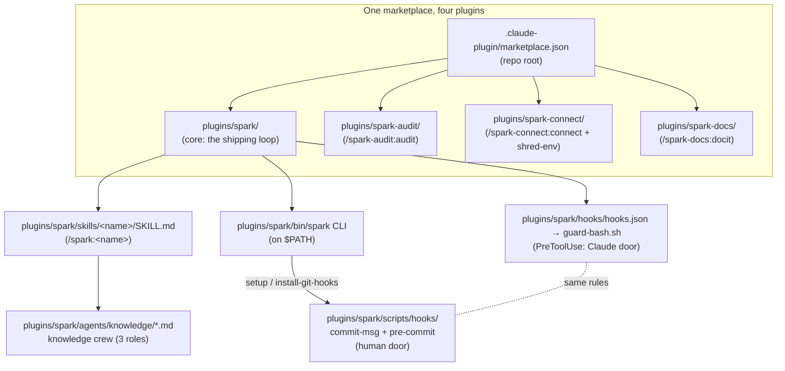

# Spark: architecture & internals

> Architecture map — how the layers fit together. The *why* lives in the linked
> ADRs and explanation docs; this doc ties the layers together and shows how they
> interact. For the reasoning behind individual decisions, follow the cross-links
> to [plugins/spark/docs/explanation/](../../plugins/spark/docs/explanation/) and [../adr/](../adr/).

## Purpose

Spark turns a Claude and a GitHub subscription into a software delivery system
for one operator running many projects: it loads the operator's engineering
standard into every repo, moves work through one traceable lifecycle from
intent to pull request, and enforces the git hygiene mechanically. The
methodology is portable; the current implementation ships as a **Claude Code
plugin marketplace** (author `jwogrady`, MIT) you add once and carry into every
project.

**The product model (ADR-0019): four parties in fixed roles.** The **human** is
the directing force — intent, judgment, acceptance, and the release decision.
**Spark** is the orchestration layer — the lifecycle sequence, the operator's
standards, and the durable workflow. **Claude** supplies the capability — the
tools and the know-how, arranged rather than reinvented. **GitHub** is the
system of record — the review/delivery surface and the durable memory where
issues, branches, pull requests, and releases persist across sessions.

Who it is for: the solo operator directing an increasingly agent-run,
human-supervised workflow. The portable core is domain- and stack-neutral *as a
fact of the design*, not a market being pitched; outward positioning is the
`spark-docs` companion's job, not this map's.

For *why* a plugin rather than a framework, see
[../adr/0001-plugin-not-framework.md](../adr/0001-plugin-not-framework.md) and
[explanation/additive.md](../../plugins/spark/docs/explanation/additive.md). This doc is the
*map*; those are the *narrative*.

## Current State

Spark is a **four-plugin marketplace** (ADR-0014): the repo-root
`.claude-plugin/marketplace.json` catalog lists a focused core plus three
companions, each under `plugins/<name>/`:

- **`spark`** — the core: the shipping loop. The nine core skills of the
  [canonical taxonomy](../../plugins/spark/docs/reference/skills.md)
  (lifecycle, setup, supporting), `setup` (one-command carry-in), preferences
  and project overrides, `brief`/`resume` and the durable work state, the two
  local enforcement doors plus the shipped trunk-ruleset policy for the third,
  `doctor`, and Release Please scaffolding.
- **`spark-audit`** — whole-project assessment and evidence-backed cleanup
  (`/spark-audit:audit`).
- **`spark-connect`** — service connectivity + secrets via 1Password
  (`/spark-connect:connect`), plus the `shred-env` helper.
- **`spark-docs`** — public docs and positioning through author personas
  (`/spark-docs:docit`).

Adding the marketplace
(`/plugin marketplace add jwogrady/spark`) makes all four installable;
`/plugin install spark` installs the core, and each companion installs by its
own name with skills namespaced under it. Only what lives under `plugins/`
ships to users; the repo-root `docs/` tree (ADRs, this map, packaging
reference) is developer documentation and never ships.

## Intended State

Two things are documented as intended/future, **not** current:

- **Per-stack scaffold branches.** Stack defaults (Bun for TS/JS, uv for
  Python) are shipped via `bootstrap`'s use of the official scaffolders, but
  there are **no** per-stack branches in this repo — that mechanism is planned,
  not implemented. The portable core is stack-neutral today.
- **A bundled `.mcp.json`** is a capability a plugin *can* carry when needed (see
  [explanation/additive.md](../../plugins/spark/docs/explanation/additive.md)), but Spark
  ships **no** `.mcp.json` at present.

## Components

The core plugin is layered:

| Layer | Lives in | Job | Reference |
|---|---|---|---|
| Marketplace catalog | `.claude-plugin/marketplace.json` (repo root) | Make the repo git-installable; lists the core + the three companions | [../ops/plugin-manifest.md](../ops/plugin-manifest.md) |
| Plugin manifests | `plugins/<name>/.claude-plugin/plugin.json` | Name and version each plugin (author `jwogrady`, MIT); companions version independently of the core | [../ops/plugin-manifest.md](../ops/plugin-manifest.md) |
| Skills | `plugins/spark/skills/<name>/SKILL.md` | The nine core skills — lifecycle, setup, supporting — exposed as `/spark:<name>` | [reference/skills.md](../../plugins/spark/docs/reference/skills.md) |
| Agent crew | `plugins/spark/agents/knowledge/*.md` | The knowledge crew (3 roles) the `knowledge` skill dispatches; companions carry their own crews | — |
| PreToolUse hook | `plugins/spark/hooks/hooks.json`, `plugins/spark/hooks/guard-bash.sh` | Enforce git hygiene on the **Claude-driven** path | [reference/hooks.md](../../plugins/spark/docs/reference/hooks.md) |
| CLI | `plugins/spark/bin/spark` | Validate the marketplace, carry the standard in, rebuild session context, scaffold skills | [reference/cli.md](../../plugins/spark/docs/reference/cli.md) |
| Git hooks | `plugins/spark/scripts/hooks/{commit-msg,pre-commit}` | Enforce the **same** rules on the **human-driven** path | [reference/hooks.md](../../plugins/spark/docs/reference/hooks.md) |
| User docs | `plugins/spark/docs/` | Ship with the plugin; Diátaxis-organized: tutorials / how-to / reference / explanation | — |
| Dev docs | `docs/` (repo root) | Never shipped: ADRs, this architecture map, packaging reference | — |

The CLI verbs live in [reference/cli.md](../../plugins/spark/docs/reference/cli.md):
the `VERBS` dispatch table in `bin/spark` is the mechanical source of truth,
and doctor holds that canonical reference in parity with it — this map (and
the agent contract, which links instead of restating) deliberately does not
restate the list.
(`shred-env` moved to `spark-connect` with the connect skill — it has no
independent core purpose.)

## Data Flow

Two flows run through Spark:

1. **Lifecycle flow** (`Ideate → Plan → Codify → Validate → Ship`). A skill is
   invoked as a `/spark:` command; its output is the next stage's input — a
   written problem statement feeds issue decomposition, which feeds a branch,
   which feeds review, which feeds a commit and PR. See
   [explanation/sdlc-doctrine.md](../../plugins/spark/docs/explanation/sdlc-doctrine.md) for the
   doctrine and the per-stage "done when". The `knowledge` skill hangs off the
   Ship+ end of the loop, capturing what the work taught.

2. **Enforcement flow** (the three doors — see below). Every git operation
   passes a guard chosen by its path: Claude-driven, human-local, or straight
   at the remote.

## The three-doors enforcement model

The doctrine — why three doors, what each one covers, and why the remote one
is never applied automatically — is stated once, in
[`plugins/spark/docs/explanation/enforcement-model.md`](../../plugins/spark/docs/explanation/enforcement-model.md).
Per-rule mechanics are in
[`plugins/spark/docs/reference/hooks.md`](../../plugins/spark/docs/reference/hooks.md).

What belongs here is only the part that is specific to *this* repository —
where each door lives on disk:

| Door | Implementation in this repo |
|---|---|
| Claude-driven | `plugins/spark/hooks/hooks.json` → `plugins/spark/hooks/guard-bash.sh` |
| Human-driven, local | `plugins/spark/scripts/hooks/{commit-msg,pre-commit}`, installed by `spark setup` / `spark install-git-hooks` |
| Remote | Shipped policy `plugins/spark/settings/github-ruleset-trunk.json`; this repo's own contract is `.github/spark-trunk-ruleset.json`, carrying its `doctor` and `tests` check contexts |

Every door enforces the same intent — blocks force-push and trunk pushes/commits;
allows `--force-with-lease` locally. The per-rule detail (what each blocks, exit codes,
fail-safe behavior) lives in [reference/hooks.md](../../plugins/spark/docs/reference/hooks.md), and
the decisions in
[../adr/0003-zero-dependency-bash-and-enforcement-hooks.md](../adr/0003-zero-dependency-bash-and-enforcement-hooks.md)
and [../adr/0027-delivery-model.md](../adr/0027-delivery-model.md).

## The subagent-orchestration pattern

The `knowledge` skill (and the companion crews behind `spark-docs` and
`spark-audit`) are multi-agent. They share one pattern:

- **The main loop is the sole orchestrator.** Subagents do not dispatch each
  other; the skill running in the main conversation dispatches each role and
  decides the phase sequence.
- **Roles coordinate through shared notes**, not direct messaging. Each role
  reads the prior phase's notes (e.g. `.knowledge-notes/00-intake.md`) and writes
  its own; the next role reads those.
- **The core crew is knowledge: 3 inward-facing roles** — intake, author,
  librarian-editor — for internal-knowledge capture. The `spark-docs` companion
  carries its own outward-facing author crew: knowledge documents *for the
  team*, docit documents *for the world*.

## Conformance

The information architecture (ADR-0008) comes with a standing test: every
shipped component must name its **layer** (Operator / Project / Session) and
its **motion** — carry-in, carry-through, or carry-forward — or be explicit
*support* with a stated rationale. "Neither, with no disposition" is a failing
verdict. The shipped inventory passes cleanly: the lifecycle skills are
carry-through, `bootstrap` and `setup` are carry-in, `knowledge` and the work
state are carry-forward, and the enforcement doors, `doctor`, and the
scaffolding verbs are explicit support for those motions.

The test lives on for every future addition — anything new must name its
layer, class, and motion before it ships. The static audit table that once
recorded the verdicts is retired: doctor now enforces taxonomy parity
mechanically (every shipped skill must appear in the canonical taxonomy), so
the inventory and its documentation cannot drift silently. The ADR-0013/0014
extractions applied the same test at product scale: surface that serves no
motion left the core for a companion.

## External Dependencies

- **Claude Code** — Spark is additive to Anthropic's skill/plugin spec and reuses
  built-in `/code-review`, `/security-review`, and `verify` rather than shipping
  its own. See
  [../adr/0002-additive-to-anthropic-spec.md](../adr/0002-additive-to-anthropic-spec.md)
  and [explanation/additive.md](../../plugins/spark/docs/explanation/additive.md).
- **Git / GitHub** — the lifecycle is GitHub-native (issues, branches, PRs).
- **No runtime dependencies in scripts.** `jq`/`python3` are used opportunistically
  for JSON parsing and degrade gracefully when absent.

## Operational Notes

- `spark doctor` validates the whole marketplace (every listed plugin's
  manifest and skill frontmatter, hook JSON, executable guard, taxonomy parity,
  doc links, enforcement lockstep, git-hook install state). Run it before pushing;
  validation CI runs the same command on every PR, so the local and CI gates
  cannot drift (ADR-0011). See [reference/cli.md](../../plugins/spark/docs/reference/cli.md).
- Git hooks are per-repo and must be installed with `spark setup` (or
  `spark install-git-hooks` alone); the plugin's PreToolUse guard travels with
  the plugin automatically.

## Risks / Unknowns

- **Three enforcement doors, one intent.** The doors model expresses the same
  rule in more than one place (hook script + git hook + ruleset policy).
  Deliberate redundancy for coverage, but a maintenance point: a rule change
  must land everywhere — the behavioral suites pin each local door, doctor's
  enforcement-lockstep check watches the enumerable vocabulary, and
  `doctor --requirements` compares the remote against the shipped policy. See
  ADR 0003, ADR 0011, and ADR 0027.
- **Zero-dependency Bash tradeoff.** Portability buys reach into any forked project
  at the cost of richer tooling; JSON handling degrades gracefully. See ADR 0003.
- **Commit paths drive companion versions.** Release Please runs in
  multi-package mode: the root train versions the core, and each companion
  releases from the commits touching its `plugins/<name>/` directory — so a
  commit that strays across plugin boundaries mis-attributes a bump. See
  ADR 0016.

## Related Docs

- [explanation/sdlc-doctrine.md](../../plugins/spark/docs/explanation/sdlc-doctrine.md) — the lifecycle doctrine
- [explanation/additive.md](../../plugins/spark/docs/explanation/additive.md) — why Spark is additive, and why a plugin
- [../adr/0001-plugin-not-framework.md](../adr/0001-plugin-not-framework.md)
- [../adr/0002-additive-to-anthropic-spec.md](../adr/0002-additive-to-anthropic-spec.md)
- [../adr/0003-zero-dependency-bash-and-enforcement-hooks.md](../adr/0003-zero-dependency-bash-and-enforcement-hooks.md)
- [../adr/0008-information-architecture.md](../adr/0008-information-architecture.md) — the layers, classes, and motions
- [../adr/0031-state-provenance-ownership.md](../adr/0031-state-provenance-ownership.md) — which surface owns current state, which owns provenance, and why runtime outranks both
- [../adr/0014-core-plus-companion-plugins.md](../adr/0014-core-plus-companion-plugins.md) — the core/companion boundary
- [glossary.md](../../plugins/spark/docs/glossary.md) — Spark-internal vocabulary
