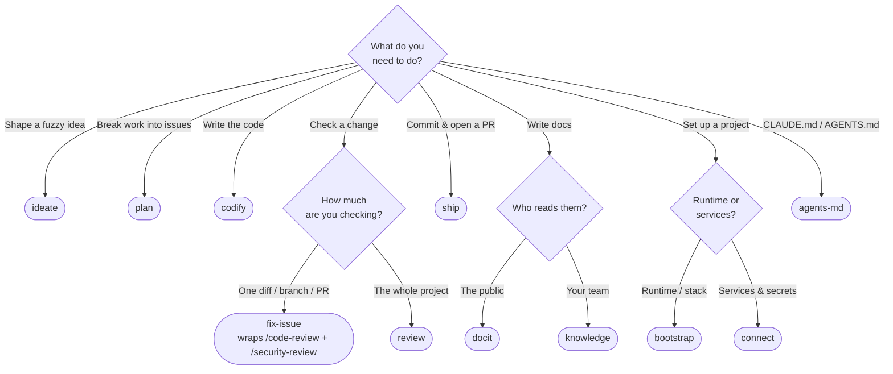

# Reference — skills

> Reference — information-oriented. What each skill is, not how to use it well
> (that's [how-to/](../how-to/)) or why it exists (that's
> [explanation/](../explanation/)).

All skills are invoked namespaced under the plugin: `/spark:<name>`.

This page is the **canonical skill taxonomy** — four categories: Lifecycle,
Setup, Authorship, Supporting. `CLAUDE.md` and `README.md` use the same grouping;
if they ever disagree, this page wins.

## Which skill do I use?

Start from what you want to do — not from the skill names. Follow the arrows:



Or scan by intent:

| I want to… | Reach for | Not… |
|---|---|---|
| Turn a fuzzy idea into a written problem statement | `ideate` | — |
| Break a problem into issues + a milestone | `plan` | — |
| Write the code for one planned issue | `codify` | — |
| Harden **one** diff/branch/PR before shipping | `fix-issue` | not `review` (that's whole-project) |
| Review just one diff with no orchestration | native `/code-review`, `/security-review` | not `review` |
| Audit the **whole** project (release readiness) | `review` | not `fix-issue` (one diff) |
| Commit a finished change + open a PR | `ship` | — |
| Write/refresh **public** docs (README, positioning) | `docit` | not `knowledge` |
| Capture **internal** knowledge (ADRs, SOPs, specs) | `knowledge` | not `docit` |
| Scaffold a new project's runtime/stack | `bootstrap` | not `connect` |
| Wire services + secrets via 1Password | `connect` | not `bootstrap` |
| Create or maintain `CLAUDE.md` / `AGENTS.md` | `agents-md` (net-new `CLAUDE.md` → native `/init` first) | — |

## Lifecycle skills

| Skill | Stage | Triggers on |
|---|---|---|
| `ideate` | Ideate | Starting something new; "I want to build X"; fuzzy scope |
| `plan` | Plan | Breaking work into features/issues; scoping a milestone |
| `codify` | Generate | Implementing one issue; writing the code for planned work |
| `fix-issue` | Solve | Reviewing/hardening a change; resolving review findings |
| `ship` | Ship | Committing; writing a commit message; pushing; opening a PR |

## Setup skills

| Skill | Purpose |
|---|---|
| `bootstrap` | Scaffold a project runtime — Bun (TypeScript) or uv (Python) — via the official scaffolder, then wire it into Spark. |
| `connect` | Bootstrap service connectivity + secrets (GitHub/GCP/Vultr/Linode) via 1Password (`op`). Capture → ingest → shred → inject. |

## Authorship skills

| Skill | Purpose |
|---|---|
| `docit` | Multi-persona crew that glows up the public docs after shipping. |
| `knowledge` | Internal-knowledge crew that captures decisions, architecture, and processes through specialist agents. |

## Supporting skills

| Skill | Purpose |
|---|---|
| `agents-md` | Maintains and audits a project's `CLAUDE.md` and `AGENTS.md`, keeping the two in sync. |
| `review` | Multi-agent **whole-project** audit by specialist agents collaborating via shared notes. Not a single-diff reviewer — for one diff/PR use the native `/code-review` + `/security-review`, or `fix-issue` to orchestrate them. |

## Skill layout

Each skill is a directory under `skills/` containing at minimum a `SKILL.md`
with YAML frontmatter:

```yaml
---
name: <matches the directory name>
description: <what it does>. Use when <specific triggers>.
---
```

The `description` is the only thing Claude sees when deciding whether to invoke
the skill, so it must name concrete triggers. Optional `references/` and
`agents/` subdirectories hold supporting material loaded on demand.

To author a new skill, scaffold it with `spark new-skill <name>` and follow the
"Skill Authoring" section of [`CLAUDE.md`](../../CLAUDE.md).
