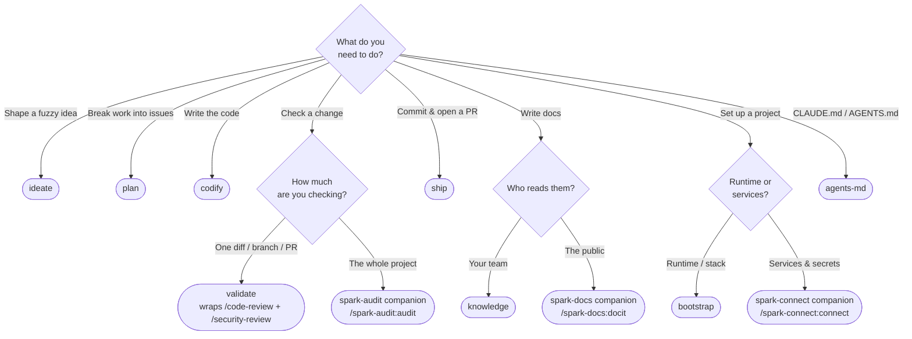

# Reference — skills

> Reference — information-oriented. What each skill is, not how to use it well
> (that's [how-to/](../how-to/)) or why it exists (that's
> [explanation/](../explanation/)).

All core skills are invoked namespaced under the plugin: `/spark:<name>`.

This page is the **canonical skill taxonomy** for the core plugin — nine
skills in three categories: Lifecycle, Setup, Supporting. `CLAUDE.md` and
`README.md` use the same grouping; if they ever disagree, this page wins.
`spark doctor` enforces this mechanically for the core: every **core** skill
that ships must appear here (the companion skills live under
[companion plugins](#companion-plugins) and are not checked against this page).

Capabilities outside the shipping loop live in the
[companion plugins](#companion-plugins) — same marketplace, separate installs.

## Which skill do I use?

Start from what you want to do — not from the skill names. Follow the arrows:



Or scan by intent:

| I want to… | Reach for | Not… |
|---|---|---|
| Turn a fuzzy idea into a written problem statement | `ideate` | — |
| Break a problem into issues + a milestone | `plan` | — |
| Write the code for one planned issue | `codify` | — |
| Harden **one** diff/branch/PR before shipping | `validate` | not a whole-project audit |
| Review just one diff with no orchestration | native `/code-review`, `/security-review` | — |
| Audit the **whole** project (release readiness, purge) | install the spark-audit companion, `/spark-audit:audit` | not `validate` (one diff) |
| Commit a finished change + open a PR | `ship` | — |
| Capture **internal** knowledge (ADRs, SOPs, specs) | `knowledge` | not public docs |
| Write/refresh **public** docs (README, positioning) | install the spark-docs companion, `/spark-docs:docit` | not `knowledge` |
| Arm a repo for the first time, start to finish | `onboard` | not a runtime scaffold (`bootstrap`) |
| Scaffold a new project's runtime/stack | `bootstrap` | not services/secrets |
| Wire services + secrets via 1Password | install the spark-connect companion, `/spark-connect:connect` | not `bootstrap` |
| Create or maintain `CLAUDE.md` / `AGENTS.md` | `agents-md` (net-new `CLAUDE.md` → native `/init` first) | — |

## Lifecycle skills

| Skill | Stage | Triggers on |
|---|---|---|
| `ideate` | Ideate | Starting something new; "I want to build X"; fuzzy scope |
| `plan` | Plan | Breaking work into features/issues; scoping a milestone |
| `codify` | Codify | Implementing one issue; writing the code for planned work |
| `validate` | Validate | Reviewing/hardening a change; resolving review findings |
| `ship` | Ship | Committing; writing a commit message; pushing; opening a PR |

## Setup skills

| Skill | Purpose |
|---|---|
| `onboard` | Guide a repository's first run as one narrative — orient, choose a profile, seed hooks + permissions + standards, and close with a brief — sequencing the CLI verbs and stopping at each human decision. |
| `bootstrap` | Scaffold a project runtime — Bun (TypeScript) or uv (Python) — via the official scaffolder, then wire it into Spark. |

Setup also has a CLI face: `spark setup` is the one-command carry-in (git
hooks, permission baseline, resolved standard) that `onboard` drives; it works
on its own for a repo that already exists. See [cli.md](cli.md).

## Supporting skills

| Skill | Purpose |
|---|---|
| `knowledge` | Internal-knowledge crew that captures decisions, architecture, and processes as durable docs (ADRs, SOPs, specs), and promotes portable vocabulary to the operator layer. |
| `agents-md` | Maintains and audits a project's `CLAUDE.md` and `AGENTS.md`, keeping the two in sync. |

## Companion plugins

The marketplace ships three companions alongside the core. Each carries a
capability that is real but not the shipping loop; installing one adds its
skills under its own namespace:

| Plugin | Carries | Install |
|---|---|---|
| `spark-audit` | Whole-project assessment and evidence-backed cleanup (`/spark-audit:audit`) | `/plugin install spark-audit` |
| `spark-connect` | Service connectivity + secrets via 1Password (`/spark-connect:connect`), plus `shred-env` | `/plugin install spark-connect` |
| `spark-docs` | Public docs and positioning through author personas (`/spark-docs:docit`) | `/plugin install spark-docs` |

All three assume the same marketplace is already added
(`/plugin marketplace add jwogrady/spark`). See ADR-0014 in the repository's
developer docs for the product boundary.

## Native built-in overlap

No core skill reimplements a Claude Code built-in — the additive stance in
[explanation/additive.md](../explanation/additive.md), made checkable. Each
skill either **delegates to** a built-in, deliberately **stays out of** its
lane, or has **no** relationship (it wraps `git`/`gh`/a scaffolder, or owns a
job the built-ins don't cover). The dedup target is native built-ins only;
Spark never designs around third-party plugins it can't assume are installed.

| Skill | Native built-in(s) touched | Relationship |
|---|---|---|
| `ideate` | `grill-me` | delegates-to — invokes it to pressure-test the problem statement; owns the framing, not the interview |
| `plan` | — | none — wraps `gh` for issues + a milestone |
| `codify` | `verify`, `run` | stays-out-of-lane — owns implementing one issue; those confirm behavior afterward |
| `validate` | `/code-review`, `/security-review` | delegates-to — orchestrates both on the branch diff, then triages and fixes; ships no reviewer of its own |
| `ship` | — | none — wraps `git` (conventional commit) + `gh` (one PR) |
| `onboard` | — | none — sequences the `spark` CLI verbs (orient/profiles/setup/brief) for the guided first run |
| `bootstrap` | — | none — wraps the official runtime scaffolder (Bun / uv) |
| `knowledge` | — | none — no built-in generates internal docs |
| `agents-md` | `/init` | delegates-to — defers net-new `CLAUDE.md` to `/init`; owns maintenance, audit, drift-check, and `AGENTS.md` |

The companions hold the same line in their own lanes: `spark-audit` audits the
whole project (the native reviewers cover one diff/PR), `spark-connect` wraps
`op`, and `spark-docs` generates docs no built-in writes.

## Skill layout

Each skill is a directory under `skills/` containing at minimum a `SKILL.md`
with YAML frontmatter:

```yaml
---
name: <matches the directory name>
description: <what it does>. Use when <specific triggers>.
---
```

The `description` is the only thing Claude sees when deciding whether to invoke
the skill, so it must name concrete triggers. Optional `references/` and
`agents/` subdirectories hold supporting material loaded on demand.

To author a new skill, scaffold it with `spark new-skill <name>` and follow the
"Skill Authoring" section of `CLAUDE.md`.
